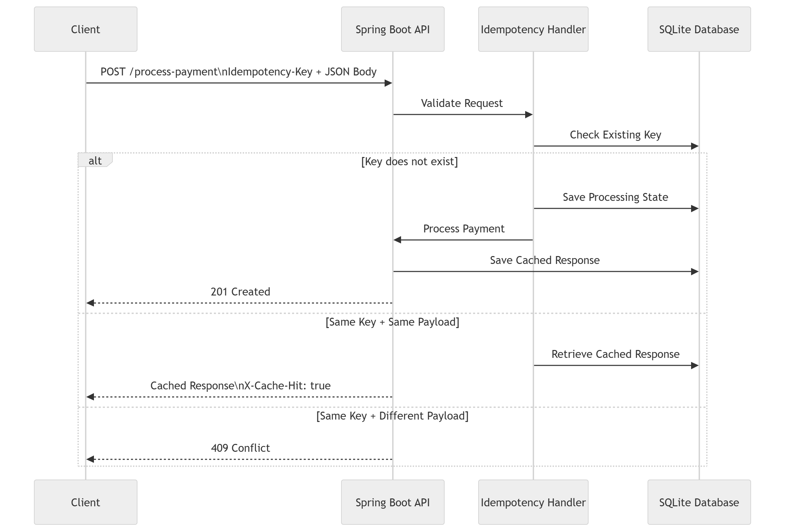
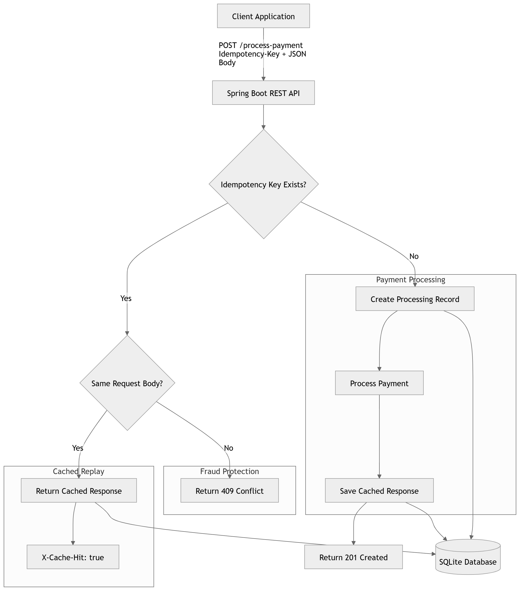

# 🚀 Idempotency Gateway API — The “Pay-Once” Protocol

A backend payment-processing API built with **Spring Boot** that prevents duplicate payment processing using **idempotency keys**.

This project simulates a fintech payment gateway where clients may retry requests because of network failures or timeouts. The API guarantees that the same payment request is processed **exactly once**, even if the client retries multiple times.

---

## ✨ Features

✅ Prevents duplicate payment processing  
✅ Supports `Idempotency-Key` request headers  
✅ Returns cached responses for duplicate requests  
✅ Detects reuse of keys with different payloads  
✅ Handles concurrent/in-flight requests safely  
✅ Uses Spring Boot REST API architecture  
✅ SQLite database integration with JPA/Hibernate  
✅ Built with Java 17 and Maven  

---

## 🏗️ System Architecture

<p align="center">
  
</p>
<p align="center">
  
</p>

<p align="center">
  Architecture diagram for the Idempotency Gateway Payment API.
</p>

---

## ❗ Problem Statement

In real-world fintech systems, payment requests can be retried automatically when a client experiences:

- Network failures
- Connection timeouts
- Slow responses

Without idempotency protection:

- Customers may be charged multiple times
- Payment records become inconsistent
- Financial trust is damaged
- Regulatory and compliance issues may arise

This project solves that problem by implementing an **Idempotency Gateway** that safely handles duplicate payment requests.

---

## 🛠️ Tech Stack

| Technology | Purpose |
|---|---|
| Java 17 | Backend language |
| Spring Boot | Backend framework |
| Spring Web | REST API development |
| Spring Data JPA | Database access |
| Hibernate | ORM |
| SQLite | Database |
| Maven | Dependency management |
| JSON | API communication |

---

## 📁 Project Structure

```bash
SHECANCODE-ASSOCIATE-ASSESSMENT-/
│
├── src/
│   ├── main/
│   │   ├── java/com/igire/gateway/
│   │   │   ├── controller/
│   │   │   │   └── PaymentController.java
│   │   │   │
│   │   │   ├── model/
│   │   │   │   ├── CachedPayment.java
│   │   │   │   ├── PaymentRequest.java
│   │   │   │   └── PaymentResponse.java
│   │   │   │
│   │   │   ├── repository/
│   │   │   │   └── PaymentRepository.java
│   │   │   │
│   │   │   ├── service/
│   │   │   │   └── PaymentService.java
│   │   │   │
│   │   │   └── IdempotencyGatewayApplication.java
│   │   │
│   │   └── resources/
│   │       └── application.properties
│   │
│   └── test/
│
├── docs/
│   └── architecture.png
│
├── payments.db
├── pom.xml
├── mvnw
├── mvnw.cmd
├── .gitignore
└── README.md
```

---

## 🔌 API Endpoint

### Process Payment

### Request

```http
POST /process-payment
```

### Headers

```http
Idempotency-Key: payment-001
```

### Request Body

```json
{
    "amount": 100,
    "currency": "USD"
}
```

---

## ✅ Successful Response

```json
{
    "message": "Charged 100 USD"
}
```

### Status

```http
201 Created
```

---

## ♻️ Duplicate Request Response

If the same request is sent again using the same `Idempotency-Key` and same body:

```json
{
    "message": "Charged 100 USD"
}
```

### Response Header

```http
X-Cache-Hit: true
```

This indicates the request was replayed safely from cache without reprocessing payment.

---

## 🚨 Fraud Protection

If a client reuses the same `Idempotency-Key` with a different request body:

```json
{
    "message": "Idempotency key already used for a different request body."
}
```

### Status

```http
409 Conflict
```

---

## 🔄 In-Flight Request Handling

This project safely handles concurrent requests.

If two identical requests arrive simultaneously:

1. The first request processes normally  
2. The second request waits  
3. The payment is processed only once  
4. Both requests receive the same response  

This prevents race conditions and duplicate charges.

---

## ⚙️ Setup Instructions

### Clone Repository

```bash
git clone https://github.com/kanezadelphine/SheCanCode-associate-Assessment-.git

cd SHECANCODE-ASSOCIATE-ASSESSMENT-
```

---

## ▶️ Run the Application

### Windows

```powershell
.\mvnw.cmd clean spring-boot:run
```

### Linux / macOS

```bash
./mvnw clean spring-boot:run
```

---

## 🌐 Server

Application runs at:

```text
http://localhost:8080/
```

---

## 🧪 Testing with Thunder Client

### Request

#### Method

```http
POST
```

#### URL

```http
http://localhost:8080/process-payment
```

#### Headers

| Key | Value |
|---|---|
| Idempotency-Key | abc123 |
| Content-Type | application/json |

#### Body

```json
{
    "amount": 100,
    "currency": "USD"
}
```

---

## 🧾 Testing Scenarios

### ✅ First Payment

- New idempotency key
- Payment processed successfully

#### Returns

```json
{
    "message": "Charged 100 USD"
}
```

---

### ♻️ Duplicate Payment

- Same key
- Same body
- Cached response returned instantly

#### Response Includes

```http
X-Cache-Hit: true
```

---

### 🚨 Fraud Attempt

- Same key
- Different body
- Request rejected

#### Response

```json
{
    "message": "Idempotency key already used for a different request body."
}
```

#### Status

```http
409 Conflict
```

---

## 💻 Example PowerShell Test

```powershell
$headers = @{
    "Idempotency-Key" = "abc456"
    "Content-Type" = "application/json"
}

$body = '{"amount":100,"currency":"USD"}'

Invoke-RestMethod `
    -Uri "http://localhost:8080/process-payment" `
    -Method POST `
    -Headers $headers `
    -Body $body
```

---

## 🚀 Future Improvements

- Redis caching for production-scale performance
- PostgreSQL integration
- Authentication and API keys
- Docker containerization
- Rate limiting
- Asynchronous task queues
- Distributed locking for microservices

---

## 👩‍💻 Author

### KANEZA Delphine

Software Engineering  & Backend Developer

### GitHub

https://github.com/kanezadelphine

### Repository

https://github.com/kanezadelphine/SheCanCode-associate-Assessment-

### Email

delphinekaneza888@gmail.com